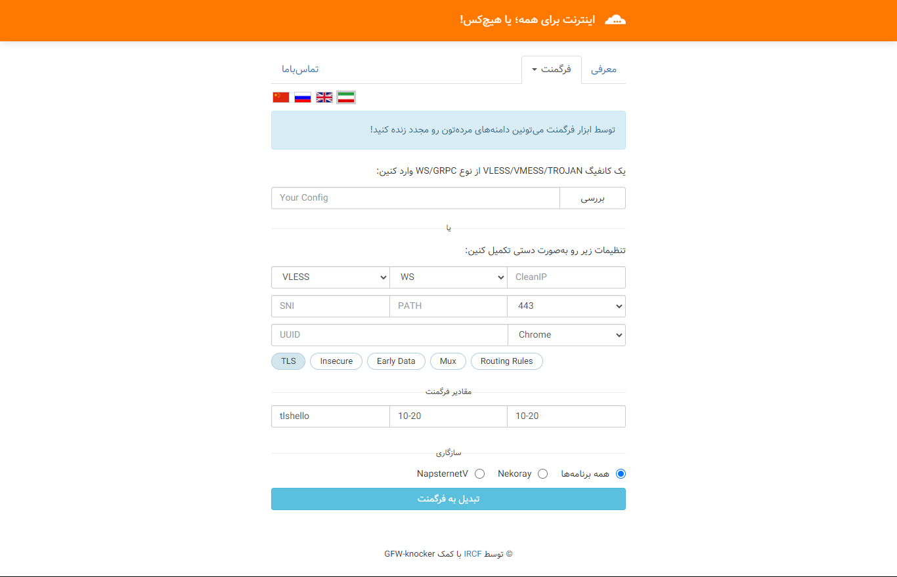

# Fragment Tool
## دور زدن فیلترینگ دامنه با فرگمنت

### توسط ابزار فرگمنت می‌تونین دامنه‌های مرده‌تون رو مجدد زنده کنید!
### Using the Fragment tool, you can revive your dead domains!

###  مناسب برای :
* VLESS [Websocket]
* VMESS [Websocket]
* VLESS [GRPC]
* VMESS [GRPC]
---

### لینکهای کاربردی در رابطه با فرگمنت :
* https://t.me/ircfspace/345
* https://youtube.com/watch?v=LXJIcLa1v6Y
* https://shorturl.at/cfpE8
* https://t.me/ircfspace/356
* https://t.me/ircfspace/292
* https://t.me/ircfspace/185

---
To participate in translating the tool into other languages, you can follow the steps below:

https://github.com/ircfspace/fragment/tree/main/assets/lang

---
Thanks for @GFW-knocker's guidance.

---

https://ircf.space \
https://ircfspace.github.io/fragment