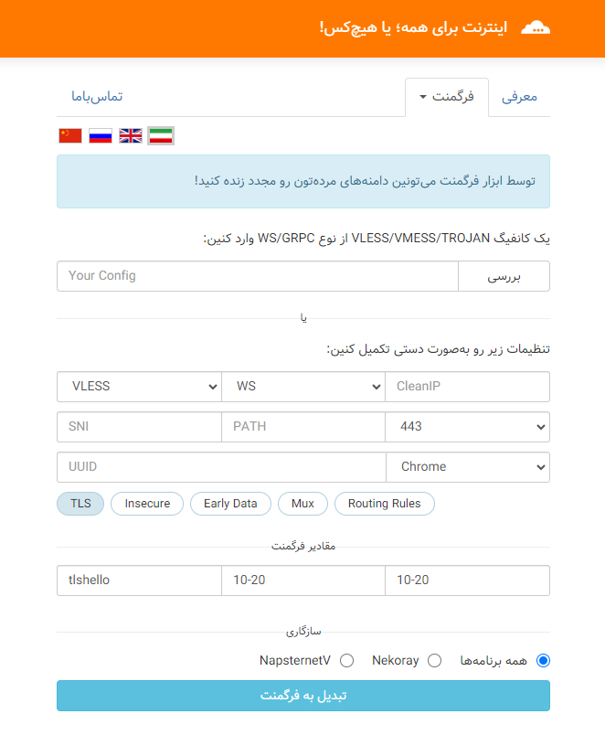

# دور زدن فیلترینگ دامنه با فرگمنت

توسط ابزار فرگمنت می‌تونین دامنه‌های مرده‌تون رو مجدد زنده کنید! 
با فرگمنت‌کردن کانفیگ‌های VLESS/VMESS/TROJAN از نوع WS/GRPC میتونین به کمک این‌ابزار و یک آی‌پی تمیز کلودفلر، فیلترینگ دامنه‌رو دور بزنین.

### فرگمنت روی چه‌مدل کانفیگ‌هایی کار میکنه؟ 
اگر سرور شخصی دارین و کانفیگ VLESS/VMESS/TROJAN رو پشت CDN کلودفلر با پروکسی روشن قرار دادین، میتونین توسط این‌ابزار کانفیگ‌های WS/GRPC رو فرگمنت کنین

### چه کلاینت‌هایی از فرگمنت پشتیبانی می‌کنن؟ 
کلاینت‌های XRAY با هسته ۱.۸.۳ به بالا، مثل آخرین نسخه از v2rayn, v2rayng, foxray یا streisand (در android, windows, ios) از قابلیت ایمپورت و استفاده از فرگمنت برخوردارن
 
* توضیحات بیشتر: https://shorturl.at/cfpE8

### روی چه اینترنت‌هایی تست شده؟ 
روی همراه‌اول، ایرانسل، مخابرات و سایر سرویس‌دهنده‌ها تست شده

 

### فرگمنت چه مقادیری داره؟  
فیلد Packets در کانفیگ فاقد TLS باید برابر ۱ و دارای TLS برابر با tlshello باشه. فیلد Length اندازه پکت‌های خردشده برحسب بایت و فیلد Interval تاخیر ارسال پکت‌ها برحسب میلی‌ثانیه هست. مثلن اگر اندازه پکت ۴۰۰ بایت باشه، با تنظیمات بالا به حدودن ۱۰۰ تکه خرد و در مدت ۵*۱۰۰ میلی‌ثانیه ارسال میشه؛ یعنی ۵۰۰ میلی‌ثانیه به پینگ اضافه میشه. با افزایش تاخیر از ۵ به ۱۰، قدرت عبور از فیلتر بیشتر، اما پینگ هم بیشتر خواهد شد.

### علت تاکید بر استفاده از آی‌پی تمیز چیه؟ 
استفاده از آی‌پی تمیز همونطور که پیش‌تر گفته‌شد، نکته کلیدی در رابطه با دورزدن فیلترینگ دامنه با فرگمنت برای کانفیگ‌های پشت CDN کلودفلر به‌شمار میره. به‌عنوان مثال تنظیماتی که برای TLS عنوان‌شده به‌صورت پیشفرض با استفاده از دامنه zula.ir به‌عنوان آی‌پی تمیز داره به‌خوبی روی ایرانسل و همراه‌اول کار میکنه، اما مثلن در رابطه با مخابرات اختلال داشته. راه‌حلش اسکن آی‌پی هست، یا اینکه سایت‌های دیگری که پشت کلودفلر هستن‌رو امتحان کنین تا به نتیجه مطلوب برسین ...
* https://ircf.space/scanner.php
* https://vfarid.github.io/cf-ip-scanner
* https://github.com/ircfspace/cf2dns/tree/master/list
* https://ircf.space/list.php

### چه نکات دیگری نیازه بدونیم؟ 
استفاده از دامنه با کاراکتر بالا خوبه، اما برای #فرگمنت مقادیر length ارتباطی با تعداد کاراکترهای دامنه نداره. برای ۱۰-۲۰، کل پکت تکه میشه به بسته‌های ۱۰ الی ۲۰ بایتی و کل پکت حدودن ۴۰۰ تا ۶۰۰ بایته، که دامنه اون وسط‌ها هست. اینتروال ۲ میلی‌ثانیه هم خیلی کمه و تو اندروید اسمبل میشه قبل‌از ارسال. بهتره ۵ به بالا باشه، که البته ۱۰ مطمئن‌تره. چون هندشیک فقط یکبار هست، delay اون تاثیری در ادامه tcp نداره.
مقدایری که به‌صورت پیشفرض برای اینترنت‌های مختلف توصیه میشه همون tlshello با 10-20 برای length و interval هست. اگه mux فعال بشه یا کانکشن TLS GRPC باشه پینگ کمتر خواهد بود؛ هرچند استفاده از IP تمیز هم در سرعت نقش مستقیم داره.

---

https://youtu.be/b1lrG9P94qw?t=922

---
### Using the Fragment tool, you can revive your dead domains!
* Thanks for @GFW-knocker's guidance.
* to participate in translating the tool into other languages, you can follow the steps below: 
  https://github.com/ircfspace/fragment/tree/main/assets/lang

---
### Fragment Tool
* https://ircf.space
* https://github.com/ircfspace/fragment